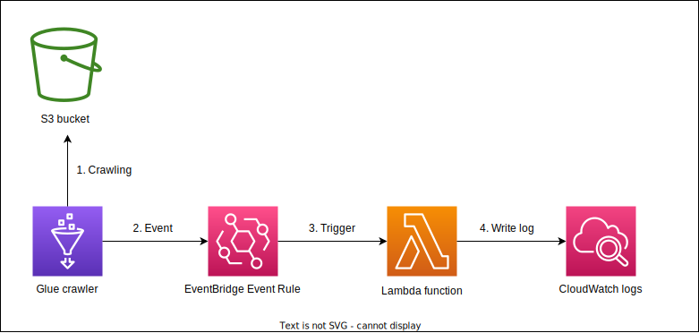

# Architecture

[](./blog_glue_trigger_architecture_diagram.drawio.svg)

# Commands to deploy & clean up

```bash
# set aws account id and region where the current EC2 instance is running.
cdk deploy --require-approval never

# Get bucket name and crawler name from CloudFormation outputs.
bucket_name=$(aws cloudformation describe-stacks --stack-name BlogGlueTriggerStack --output text --query 'Stacks[0].Outputs[?OutputKey==`BlogGlueCrawlerBucketName`].OutputValue')
crawler_name=$(aws cloudformation describe-stacks --stack-name BlogGlueTriggerStack --output text --query 'Stacks[0].Outputs[?OutputKey==`BlogGlueCrawlerName`].OutputValue')
log_group_name=$(aws cloudformation describe-stacks --stack-name BlogGlueTriggerStack --output text --query 'Stacks[0].Outputs[?OutputKey==`BlogGlueCrawlerEventHandlerLogGroupName`].OutputValue')

# Put test data on S3, run the crawler, and tail logs.
aws s3 sync ./s3_test_data/data "s3://${bucket_name}/data"
aws glue start-crawler --name "${crawler_name}"
aws logs tail --follow "${log_group_name}"

# Clean Up
# Emptying the bucket. Without it, cdk destroy will fail.
aws s3 rm "s3://${bucket_name}" --recursive
cdk destroy --force
```

# References

- https://aws.amazon.com/blogs/big-data/event-driven-refresh-of-spice-datasets-in-amazon-quicksight/
